# CL-FCL Baseline

A compact, explicit PyTorch baseline for **Federated Learning (FL)** and **Federated Continual Learning (FCL)**, plus implementations of **FedKEMF**, **FedAvg**, **FedProx**, **Scaffold**, **MOON**, and **FedWeIT**.

The code intentionally avoids:
- registries
- YAML configs
- implicit component construction

Everything is created directly in Python so the flow is easy to read and edit.

**What's included**

Federated Learning (FL)
- `FedAvgAggregator`
- `FederatedServer`, `FederatedClient`, `FederatedExperiment`

Federated Continual Learning (FCL)
- `NaiveContinualStrategy`
- `ContinualClient`, `FCLServer`, `FCLExperiment`

FedKEMF (knowledge distillation + multi-model fusion)
- `FedKEMClient`
- `FedKEMServerAggregator`
- `run_FedKEMF.py`

FedWeIT Federated Continual Learning
- `FedWeITClient`
- `FedWeITServer`
- `run_FedWeIT.py`
- `run_FedWeIT_PGD.py` adds PGD robust evaluation to FedWeIT
- `run_FedWeIT_FAT.py` combines FedWeIT with local Federated Adversarial Training
- `run_FedWeIT_SFAT.py` combines FedWeIT with Slack Federated Adversarial Training
- `run_FedWeIT_CalFAT.py` combines FedWeIT with Calibrated Federated Adversarial Training
- `run_FedWeIT_RBN.py` combines FedWeIT with FedRBN-style local BatchNorm personalization
- `run_FedWeIT_Sylva.py` combines FedWeIT with Sylva-inspired personalized adversarial fine-tuning

FedProx (proximal regularization)
- `FedProxClient`, `FedProxTrainer`
- `run_FedProx.py`

MOON (model-contrastive federated learning)
- `MoonClient`, `MoonTrainer`
- `run_MOON.py`

Data + Models
- `cifar10`, `cifar100`, `MNIST`
- `VGG11`, `ResNet18`, `ResNet20`, `ResNet32`


**Quickstart**

Run FedAvg:
```bash
python -m cl_fcl_baseline.experiments.run_FedAvg
```

Run FedKEMF:
```bash
python -m cl_fcl_baseline.experiments.run_FedKEMF
```

Run FedProx:
```bash
python -m cl_fcl_baseline.experiments.run_FedProx
```

Run MOON:
```bash
python -m cl_fcl_baseline.experiments.run_MOON
```

Run FCL:
```bash
python -m cl_fcl_baseline.experiments.run_fcl
```

Run FedWeIT:
```bash
python -m cl_fcl_baseline.experiments.run_FedWeIT
```

Run FedWeIT-PGD:
```bash
python -m cl_fcl_baseline.experiments.run_FedWeIT_PGD
```

Run FedWeIT-FAT:
```bash
python -m cl_fcl_baseline.experiments.run_FedWeIT_FAT
```

Run FedWeIT-SFAT:
```bash
python -m cl_fcl_baseline.experiments.run_FedWeIT_SFAT
```

Run FedWeIT-CalFAT:
```bash
python -m cl_fcl_baseline.experiments.run_FedWeIT_CalFAT
```

Run FedWeIT-RBN:
```bash
python -m cl_fcl_baseline.experiments.run_FedWeIT_RBN
```

Run FedWeIT-Sylva:
```bash
python -m cl_fcl_baseline.experiments.run_FedWeIT_Sylva
```

**FedWeIT usage notes**

`run_FedWeIT.py` targets the Algorithm 1 FedWeIT flow. Each client maintains `B_c`, task masks `m_c^(t)`, task-adaptive parameters `A_c^(1:t)`, and attention weights `alpha_c^(t)`. The server samples a task knowledge base, distributes it once per client/task, aggregates `B_c^(t,r) * m_c^(t,r)` by client mean, and appends client `A_c^(t)` states into `kb` at task end.

Common options:
- `--dataset` `random_classification` | `mnist` | `cifar10` | `cifar100`
- `--num-tasks` number of continual tasks
- `--classes-per-task` class split size for class-incremental datasets
- `--rounds-per-task` communication rounds per task
- `--local_epochs` local epochs per round
- `--lambda1` FedWeIT `lambda_l1` coefficient for adaptive parameters `A`
- `--lambda2` Eq.2 retroactive coefficient for old-task compensation
- `--lambda-mask` FedWeIT `lambda_mask` coefficient for raw mask variables; the reference default is `0`
- `--kb-sample-size` number of knowledge-base entries sampled per task (`<=0` means all)
- `--client-sparsity` fraction of smallest raw-mask entries pruned from communicable `B*m`
- `--mask-init` task-mask initialization; `<0` uses random raw-mask initialization like the reference implementation

Example:
configuration:
```bash
python -m cl_fcl_baseline.experiments.run_FedWeIT \
  --dataset cifar100 \
  --model ResNet32 \
  --num-clients 5 \
  --client-sample-ratio 0.4 \
  --partition noniid \
  --noniid-method dirichlet \
  --dirichlet-beta 0.5 \
  --num-tasks 10 \
  --classes-per-task 10 \
  --rounds-per-task 40 \
  --local_epochs 10 \
  --batch-size 64 \
  --lr 0.005 \
  --optimizer adam \
  --lambda1 0.0005 \
  --lambda2 30 \
  --lambda-mask 0 \
  --kb-sample-size 0 \
  --client-sparsity 0.3 \
  --mask-init -1.0 \
  --adaptive-threshold -1.0 \
```

result:
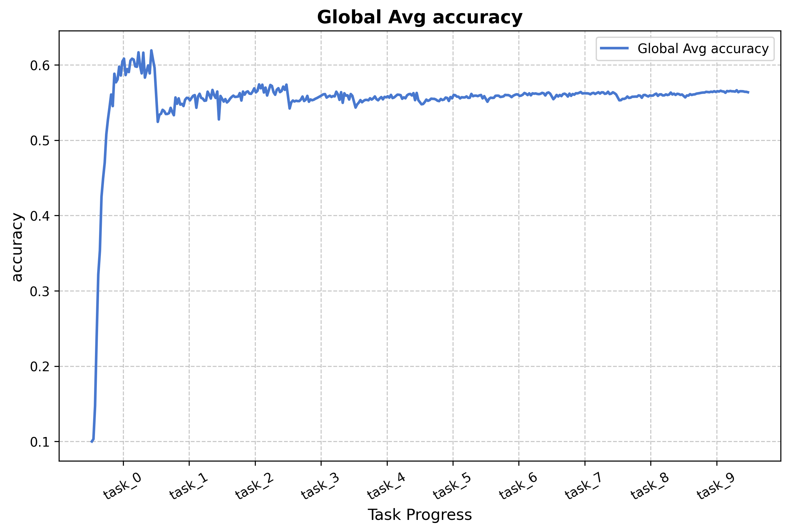
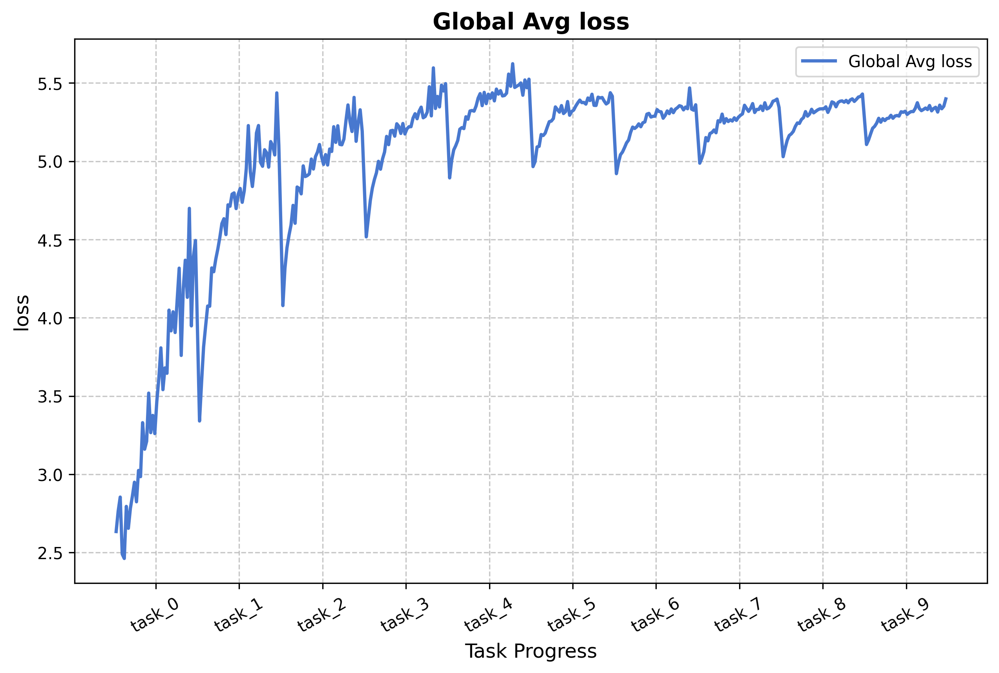
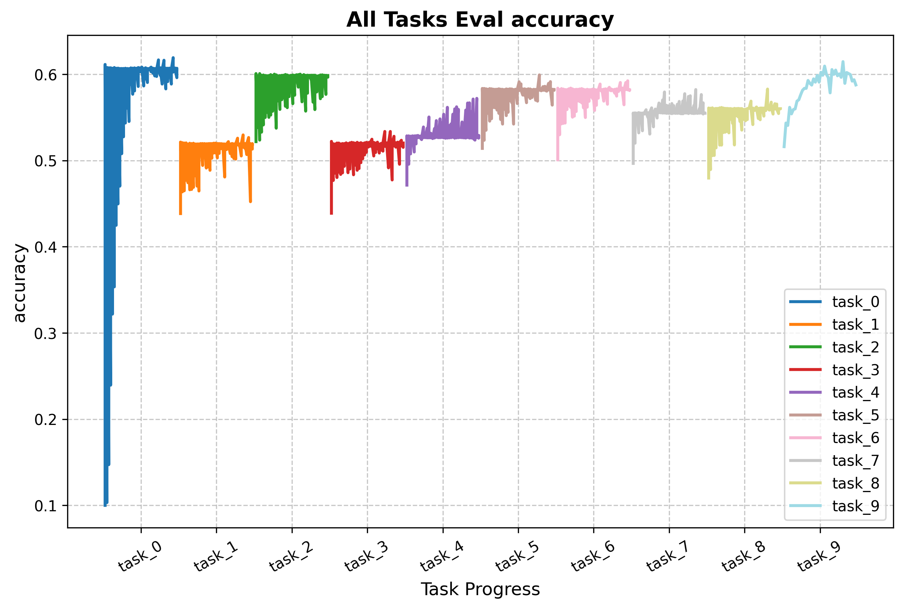


FedWeIT-PGD keeps the FedWeIT optimization flow unchanged and adds PGD robust evaluation after each task/round.

with robust accuracy:
```bash
python -m cl_fcl_baseline.experiments.run_FedWeIT_PGD \
  --dataset cifar100 \
  --model ResNet32 \
  --num-clients 5 \
  --client-sample-ratio 0.4 \
  --partition noniid \
  --noniid-method dirichlet \
  --dirichlet-beta 0.5 \
  --num-tasks 10 \
  --classes-per-task 10 \
  --rounds-per-task 20 \
  --local_epochs 10 \
  --batch-size 64 \
  --lr 0.005 \
  --optimizer adam \
  --lambda1 0.0005 \
  --lambda2 30 \
  --lambda-mask 0 \
  --kb-sample-size 0 \
  --client-sparsity 0.3 \
  --mask-init -1.0 \
  --adaptive-threshold -1.0 \
  --pgd-epsilon 8.0/255.0 \
  --pgd-step-size 2.0/255.0 \
  --pgd-steps 10 \
  --pgd-max-batches 0 \
```
result:
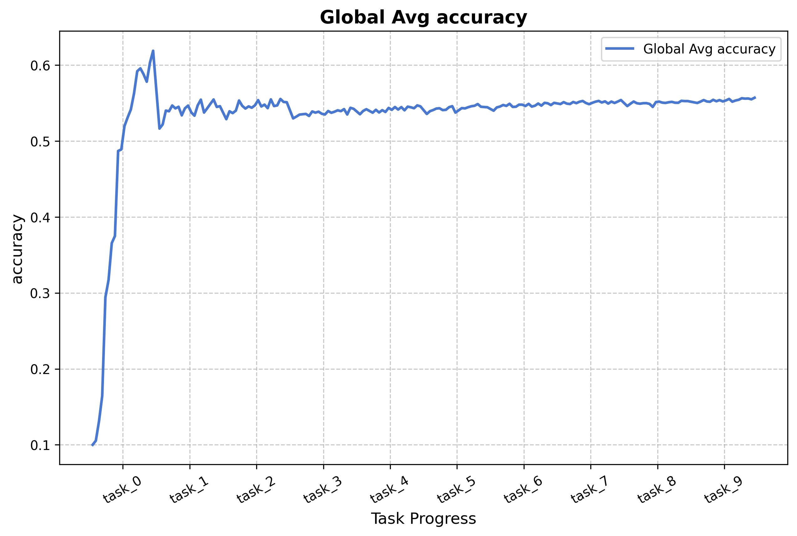
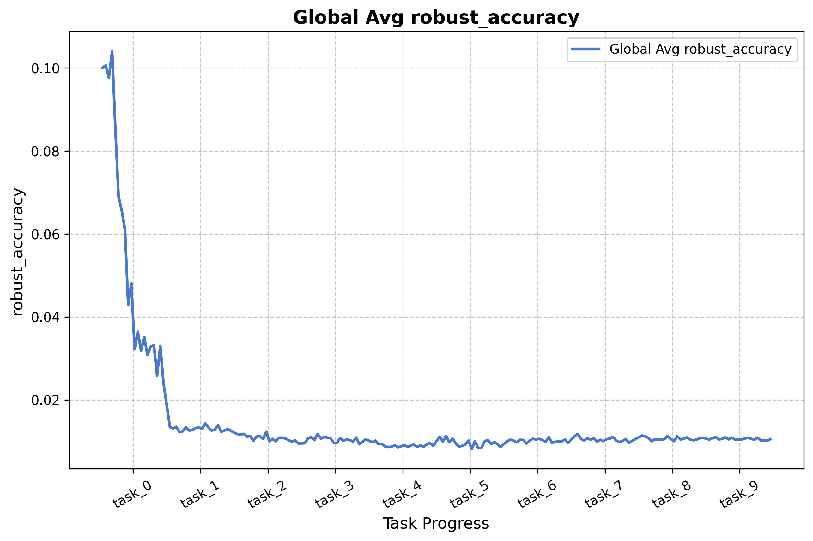
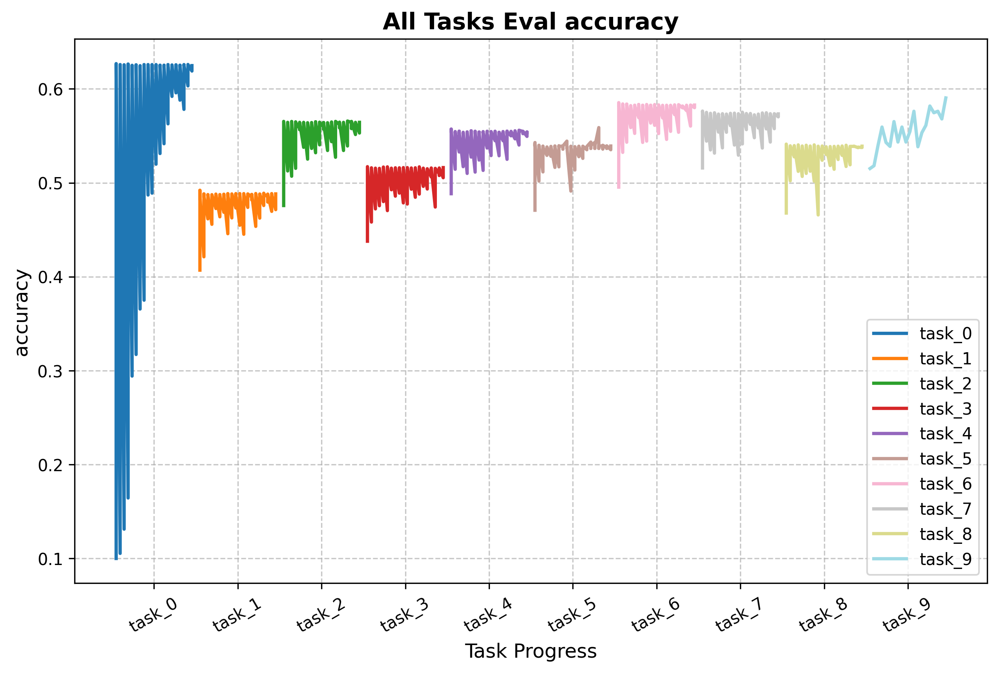
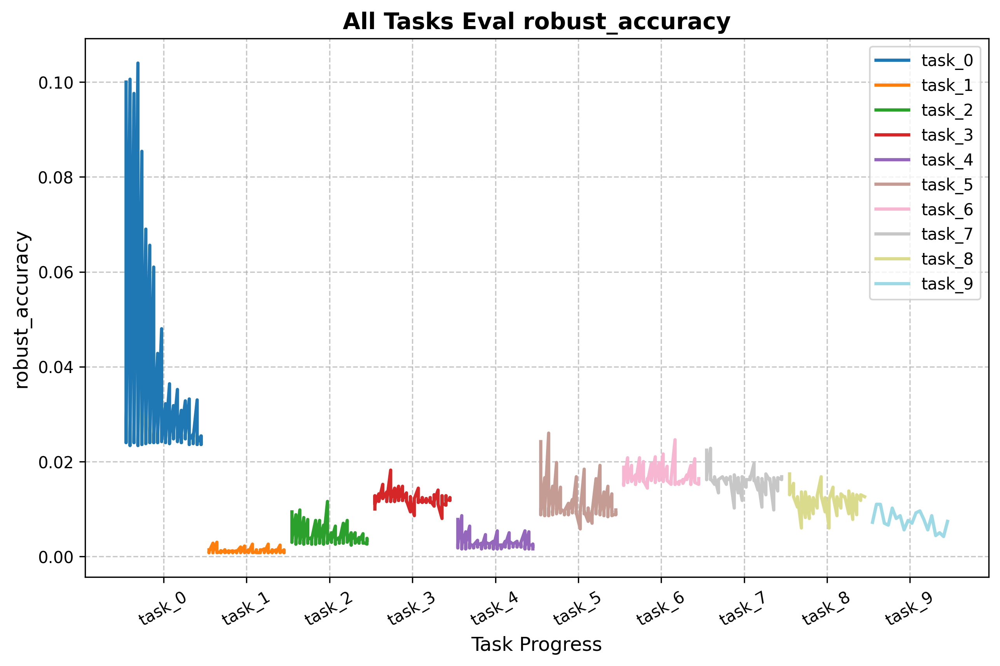

FedWeIT-FAT uses the same FedWeIT task/mask/knowledge-base flow, but each local minibatch is mixed with PGD adversarial examples before the FedWeIT update. FAT-specific options:
- `--fat-adversarial-ratio` target adversarial proportion in each local minibatch after warmup
- `--fat-warmup-rounds` number of initial rounds per task using the warmup ratio
- `--fat-warmup-adversarial-ratio` adversarial proportion during warmup
- `--pgd-epsilon`, `--pgd-step-size`, `--pgd-steps`, `--pgd-random-start` control both FAT example generation and robust evaluation

Example:
```bash
python -m cl_fcl_baseline.experiments.run_FedWeIT_FAT \
  --dataset cifar100 \
  --model ResNet32 \
  --num-clients 5 \
  --client-sample-ratio 0.4 \
  --partition noniid \
  --noniid-method dirichlet \
  --dirichlet-beta 0.5 \
  --num-tasks 10 \
  --classes-per-task 10 \
  --rounds-per-task 20 \
  --local_epochs 10 \
  --batch-size 64 \
  --lr 0.005 \
  --optimizer adam \
  --lambda1 0.0005 \
  --lambda2 30 \
  --kb-sample-size 0 \
  --fat-adversarial-ratio 0.5 \
  --fat-warmup-rounds 0 \
  --pgd-epsilon 0.031372549 \
  --pgd-step-size 0.007843137 \
  --pgd-steps 10
```
result:
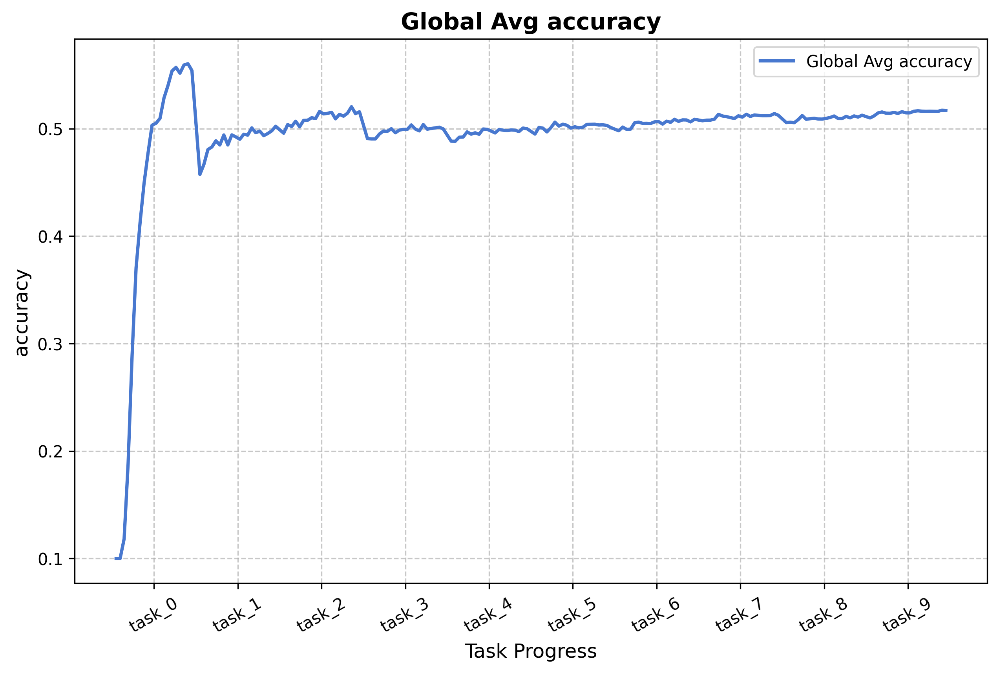
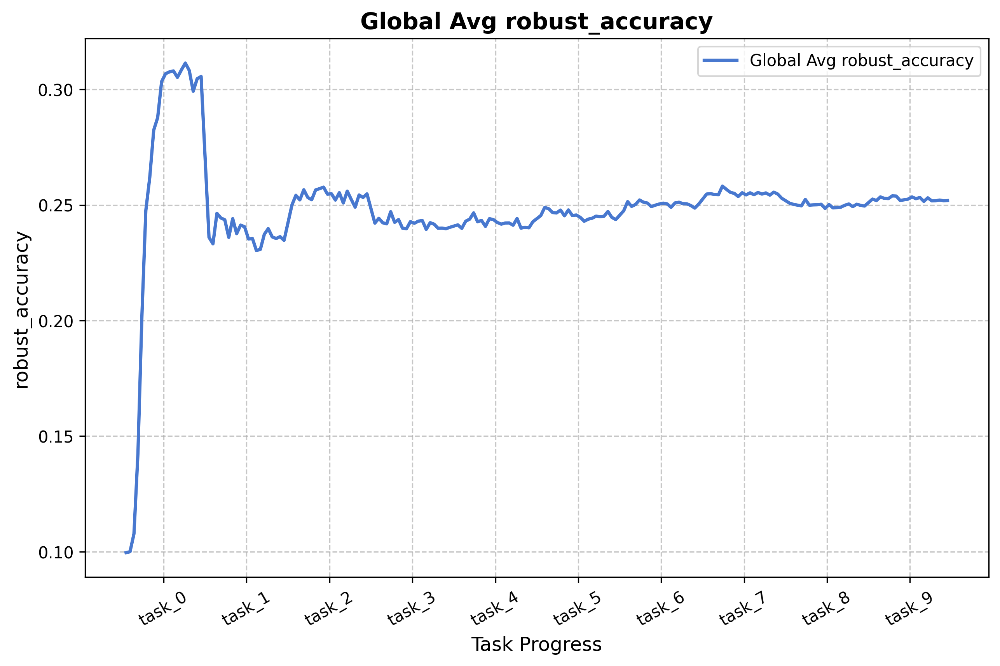
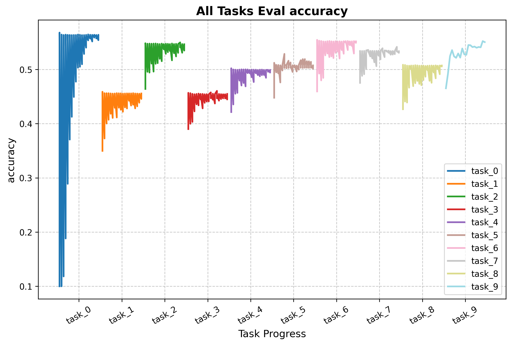
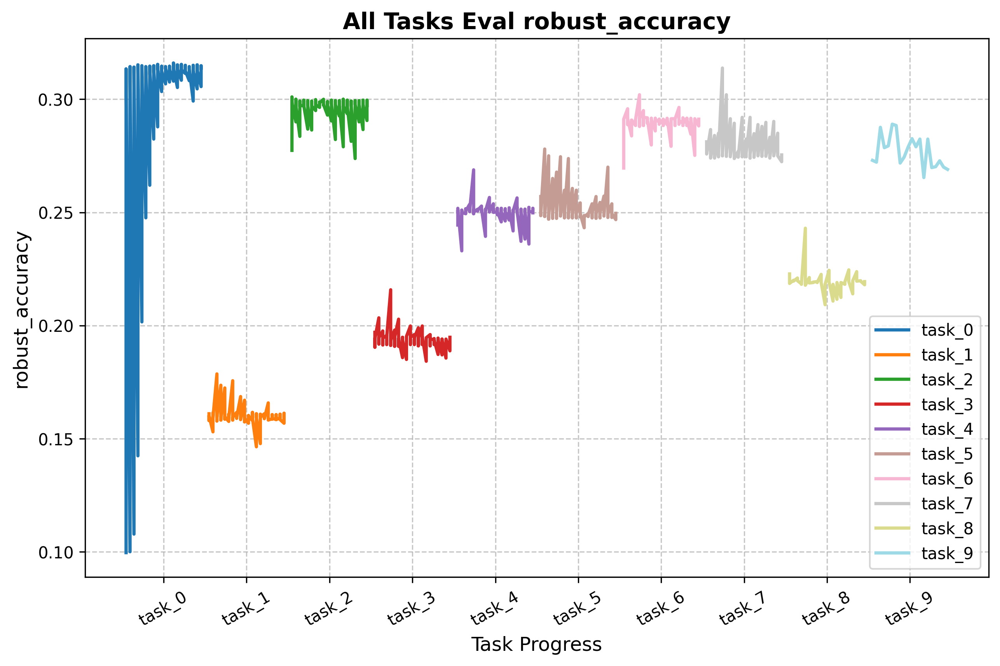


FedWeIT-SFAT keeps the FedWeIT + adversarial-training local step, then applies SFAT's alpha-slack client reweighting during server aggregation. SFAT-specific options:
- `--sfat-adversarial-ratio` target adversarial proportion in each local minibatch after warmup
- `--sfat-warmup-rounds` number of initial rounds per task using the warmup ratio
- `--sfat-warmup-adversarial-ratio` adversarial proportion during warmup
- `--sfat-alpha` SFAT slack factor used to upweight selected low-loss clients
- `--sfat-enhanced-clients` number of clients upweighted in each round
- `--sfat-loss-metric` client metric used for SFAT ranking
- `--pgd-epsilon`, `--pgd-step-size`, `--pgd-steps`, `--pgd-random-start` control both adversarial example generation and robust evaluation

Example:
```bash
python -m cl_fcl_baseline.experiments.run_FedWeIT_SFAT \
  --dataset cifar100 \
  --model ResNet32 \
  --num-clients 5 \
  --client-sample-ratio 0.4 \
  --partition noniid \
  --noniid-method dirichlet \
  --dirichlet-beta 0.5 \
  --num-tasks 10 \
  --classes-per-task 10 \
  --rounds-per-task 20 \
  --local_epochs 10 \
  --batch-size 64 \
  --lr 0.005 \
  --optimizer adam \
  --lambda1 0.0005 \
  --lambda2 30 \
  --kb-sample-size 0 \
  --sfat-adversarial-ratio 0.5 \
  --sfat-alpha 0.09090909 \
  --sfat-enhanced-clients 1 \
  --sfat-loss-metric adv_ce_loss \
  --pgd-epsilon 0.031372549 \
  --pgd-step-size 0.007843137 \
  --pgd-steps 10
```
result:
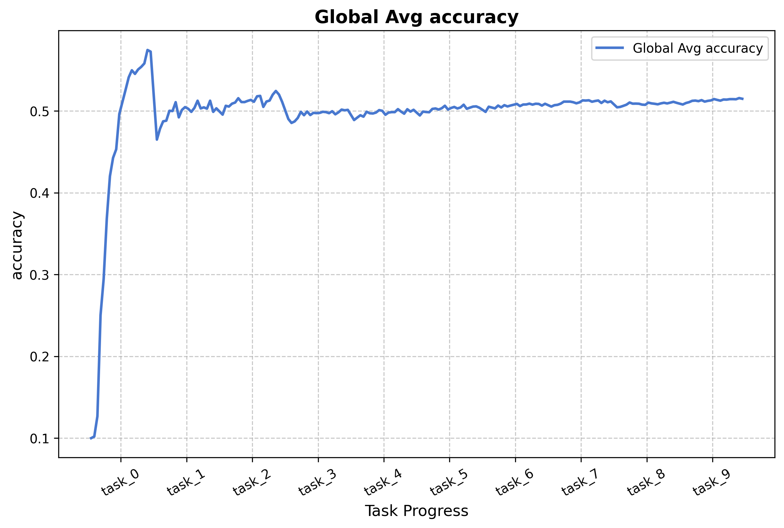
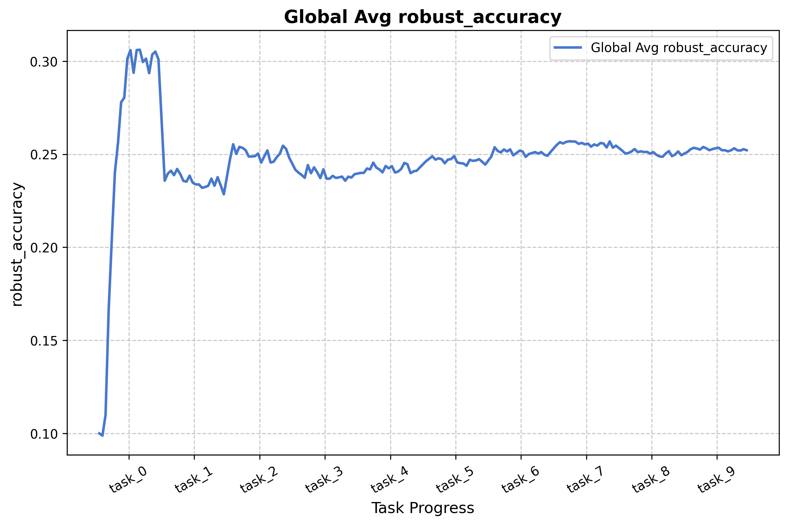
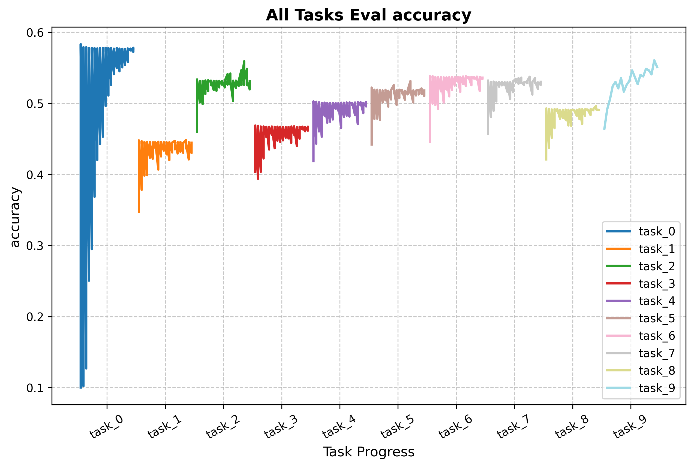
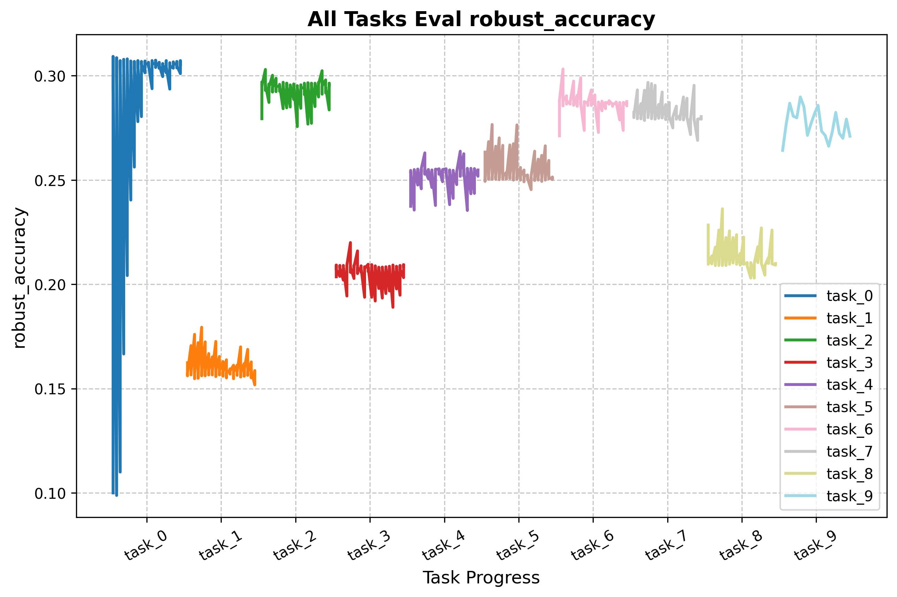

FedWeIT-CalFAT keeps the FedWeIT task/mask/knowledge-base flow and uses calibrated adversarial supervision based on smoothed local class priors. CalFAT-specific options:
- `--calfat-prior-smoothing` smoothing constant added to class priors before calibration
- `--pgd-epsilon`, `--pgd-step-size`, `--pgd-steps`, `--pgd-random-start` control both adversarial example generation and robust evaluation

Example:
```bash
python -m cl_fcl_baseline.experiments.run_FedWeIT_CalFAT \
  --dataset cifar100 \
  --model ResNet32 \
  --num-clients 5 \
  --client-sample-ratio 0.4 \
  --partition noniid \
  --noniid-method dirichlet \
  --dirichlet-beta 0.5 \
  --num-tasks 10 \
  --classes-per-task 10 \
  --rounds-per-task 20 \
  --local_epochs 10 \
  --batch-size 64 \
  --lr 0.005 \
  --optimizer adam \
  --lambda1 0.0005 \
  --lambda2 30 \
  --kb-sample-size 0 \
  --calfat-prior-smoothing 1e-6 \
  --pgd-epsilon 0.031372549 \
  --pgd-step-size 0.007843137 \
  --pgd-steps 10
```
result:
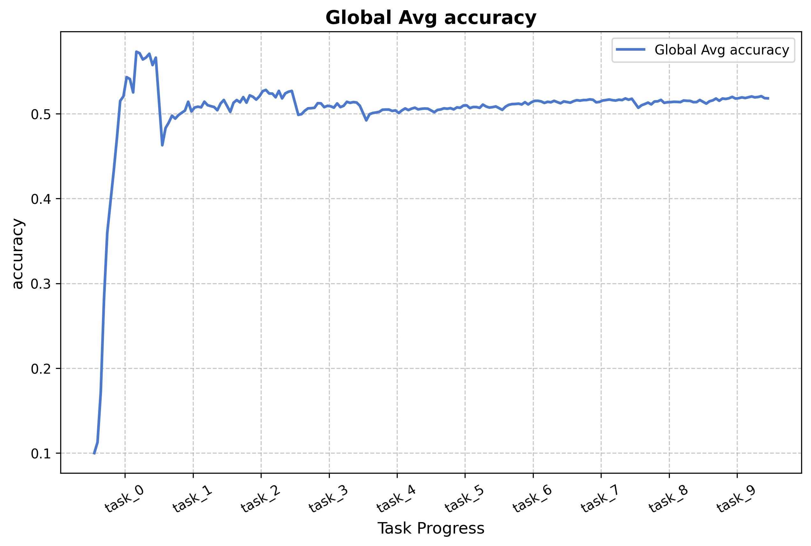
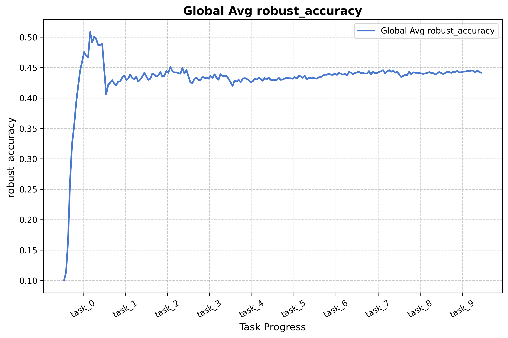
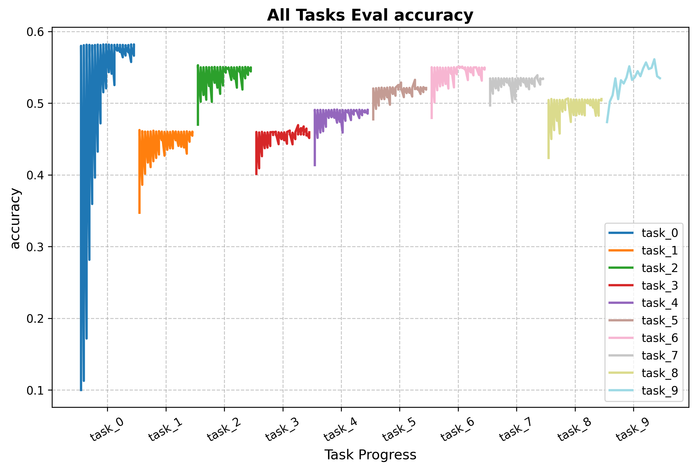
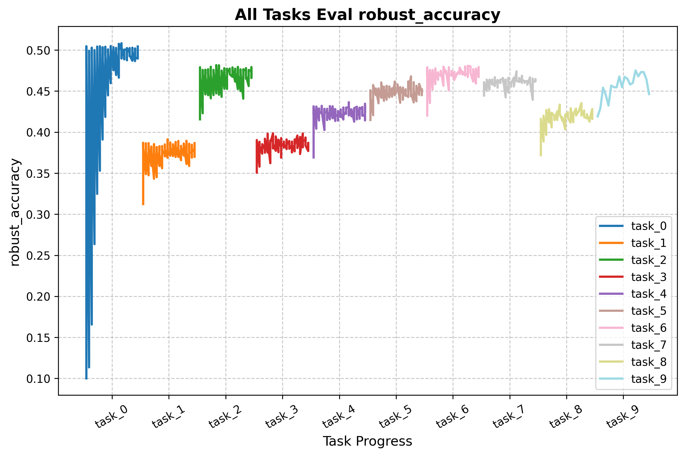


FedWeIT-RBN combines FedWeIT with FedRBN-style local BatchNorm personalization: a subset of AT users trains with adversarial loss, ST users receive propagated adversarial BatchNorm statistics, and optional PNC regularization can be enabled. RBN-specific options:
- `--rbn-at-ratio` fraction of clients treated as AT users
- `--rbn-adv-lambda` weight on the adversarial loss term for AT users
- `--rbn-src-weight-mode` propagation weighting for BatchNorm statistics (`eq` or `cos`)
- `--rbn-pnc` pseudo-noise calibration coefficient for ST users; `<0` disables PNC
- `--rbn-pnc-warmup` number of initial task rounds with zero PNC coefficient
- `--rbn-attack-noised-bn` whether PGD for AT users uses the noised BatchNorm path
- `--pgd-epsilon`, `--pgd-step-size`, `--pgd-steps`, `--pgd-random-start` control both adversarial example generation and robust evaluation

FedWeIT-RBN requires a BatchNorm-based backbone such as `VGG11`, `ResNet18`, `ResNet20`, or `ResNet32`.


Example:
```bash
python -m cl_fcl_baseline.experiments.run_FedWeIT_RBN \
  --dataset cifar100 \
  --model ResNet32 \
  --num-clients 5 \
  --client-sample-ratio 0.4 \
  --partition noniid \
  --noniid-method dirichlet \
  --dirichlet-beta 0.5 \
  --num-tasks 10 \
  --classes-per-task 10 \
  --rounds-per-task 20 \
  --local_epochs 10 \
  --batch-size 64 \
  --lr 0.005 \
  --optimizer adam \
  --lambda1 0.0005 \
  --lambda2 30 \
  --kb-sample-size 0 \
  --rbn-at-ratio 1.0 \
  --rbn-adv-lambda 0.5 \
  --rbn-src-weight-mode cos \
  --rbn-pnc 0.5 \
  --rbn-pnc-warmup 10 \
  --pgd-epsilon 0.031372549 \
  --pgd-step-size 0.007843137 \
  --pgd-steps 10
```

[//]: # (result:)

[//]: # (![FedWeIT-RBN]&#40;cl_fcl_baseline/analyse/plot-FedWeIT-CalFAT/eval_avg_global/global_avg_accuracy.png&#41;)

[//]: # (![FedWeIT-RBN]&#40;cl_fcl_baseline/analyse/plot-FedWeIT-CalFAT/eval_avg_global/global_avg_robust_accuracy.png&#41;)

[//]: # (![FedWeIT-RBN]&#40;cl_fcl_baseline/analyse/plot-FedWeIT-CalFAT/eval_compare/all_tasks_accuracy.png&#41;)

[//]: # (![FedWeIT-RBN]&#40;cl_fcl_baseline/analyse/plot-FedWeIT-CalFAT/eval_compare/all_tasks_robust_accuracy.png&#41;)


FedWeIT-Sylva combines FedWeIT with Sylva-inspired personalized adversarial fine-tuning: class-balanced adversarial local training, similarity-aware aggregation, and a second benign refinement phase on selected layer groups after each task. Sylva-specific options:
- `--sylva-class-balance-power` inverse-frequency exponent for class-balanced local loss
- `--sylva-dynamic-rounds` number of rounds used to ramp from uniform to imbalance-aware weights
- `--sylva-clean-weight`, `--sylva-adv-weight`, `--sylva-kl-weight` weights for clean CE, adversarial CE, and TRADES-style KL consistency
- `--sylva-global-reg` local-to-global shared-parameter alignment penalty
- `--sylva-agg-temperature`, `--sylva-agg-neighbors` similarity-aware aggregation controls
- `--sylva-phase2-epochs`, `--sylva-phase2-topk-layers`, `--sylva-phase2-tradeoff`, `--sylva-phase2-lr-scale`, `--sylva-phase2-max-batches` control the post-task benign refinement phase
- `--pgd-epsilon`, `--pgd-step-size`, `--pgd-steps`, `--pgd-random-start` control both adversarial example generation and robust evaluation

Example:
```bash
python -m cl_fcl_baseline.experiments.run_FedWeIT_Sylva \
  --dataset cifar100 \
  --model ResNet32 \
  --num-clients 5 \
  --client-sample-ratio 0.4 \
  --partition noniid \
  --noniid-method dirichlet \
  --dirichlet-beta 0.5 \
  --num-tasks 10 \
  --classes-per-task 10 \
  --rounds-per-task 20 \
  --local_epochs 10 \
  --batch-size 64 \
  --lr 0.005 \
  --optimizer adam \
  --lambda1 0.0005 \
  --lambda2 30 \
  --kb-sample-size 0 \
  --sylva-class-balance-power 0.6 \
  --sylva-dynamic-rounds 3 \
  --sylva-clean-weight 0.8 \
  --sylva-adv-weight 1.25 \
  --sylva-kl-weight 8.0 \
  --sylva-global-reg 1e-4 \
  --sylva-agg-temperature 0.7 \
  --sylva-agg-neighbors 2 \
  --sylva-phase2-epochs 10 \
  --sylva-phase2-topk-layers 1 \
  --sylva-phase2-tradeoff 0.7 \
  --sylva-phase2-lr-scale 0.0015 \
  --sylva-phase2-max-batches 10 \
  --pgd-epsilon 0.031372549 \
  --pgd-step-size 0.007843137 \
  --pgd-steps 10
```
result:
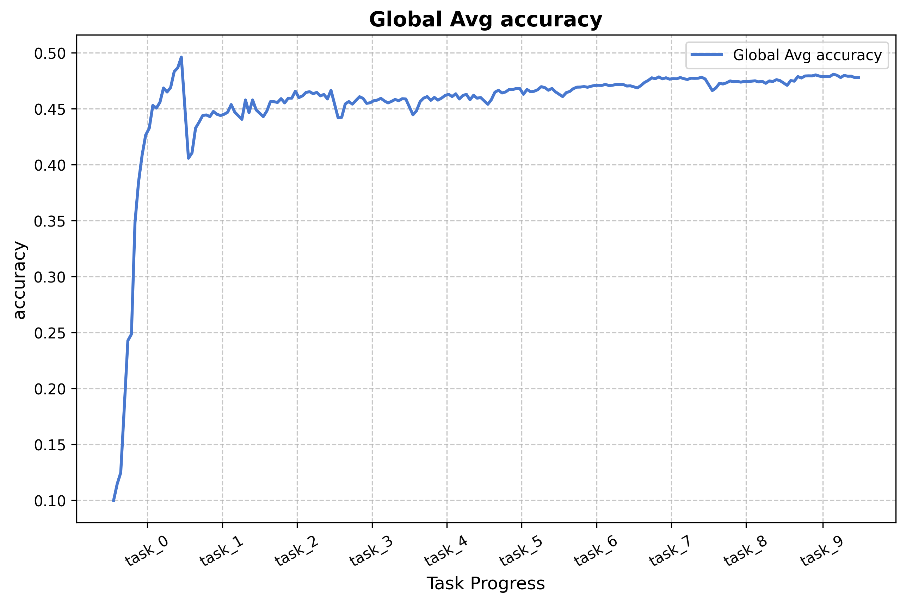
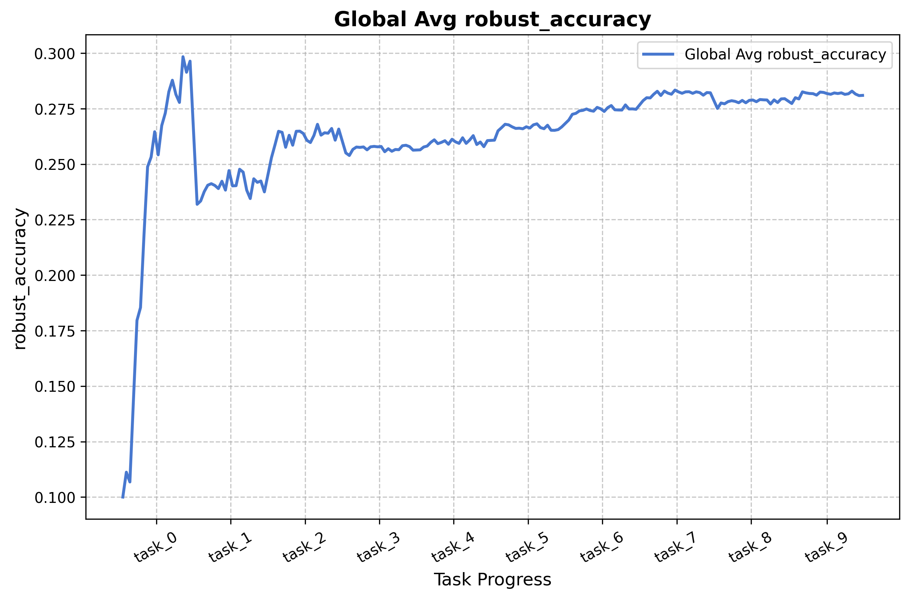
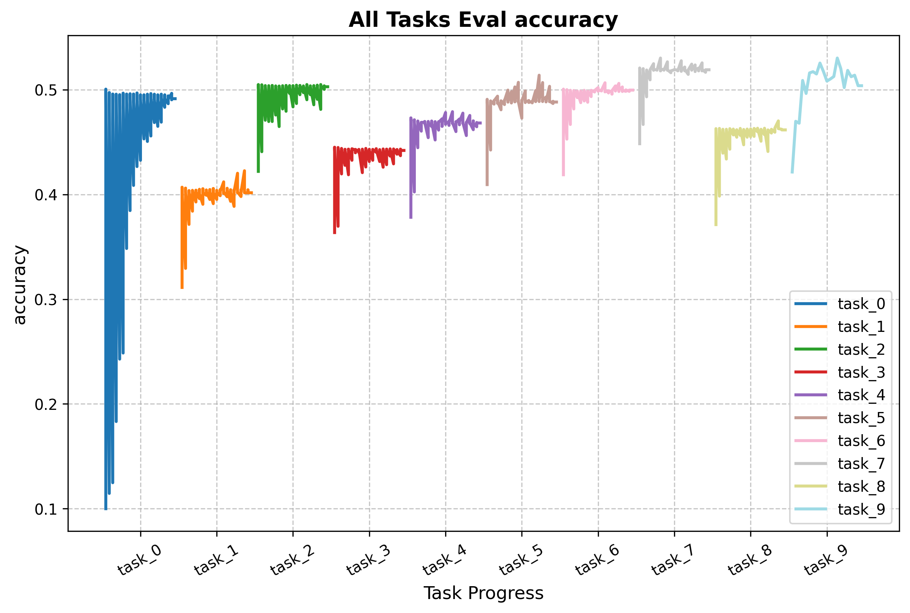
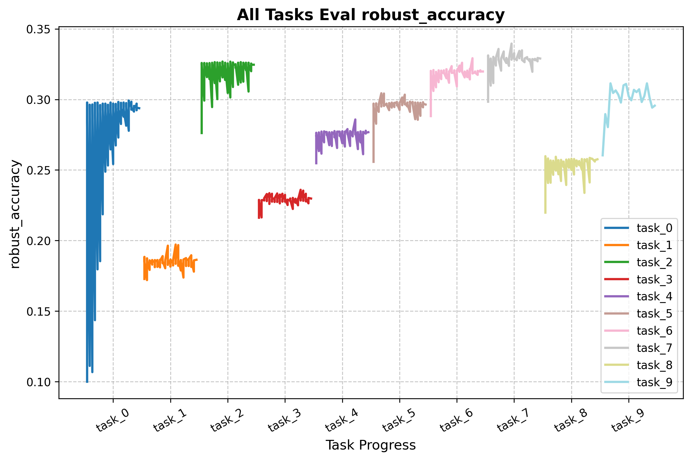


**FedAvg usage notes**

FedAvg is the standard federated averaging baseline: each client trains locally and the server aggregates client parameters with sample-size weighting. Important settings live in `cl_fcl_baseline/experiments/args.py` and are parsed by `run_FedAvg.py`.

Common options:
- `--num-clients` total clients
- `--client-sample-ratio` fraction of clients per round
- `--partition` `iid` or `noniid`
- `--noniid-method` `dirichlet` or `shards`
- `--dirichlet-beta` heterogeneity (smaller = more non-IID)
- `--num-rounds` communication rounds
- `--local_epochs` local epochs per round
- `--batch-size` batch size
- `--lr` learning rate
- `--optimizer` `sgd` or `adam`
- `--device` `cpu` | `cuda` | `cuda:0` | `auto`
- `--model` `mlp` | `simplecnn` | `VGG11` | `ResNet18` | `ResNet20` | `ResNet32`
- `--eval-every` evaluation frequency (rounds)
- `--log-file` JSONL log path (empty = auto)

Example (reproducing experiments):
configuration:
```bash
python -m cl_fcl_baseline.experiments.run_FedAvg \
  --seed 0 \
  --dataset cifar10 \
  --model ResNet32 \
  --num-clients 30 \
  --client-sample-ratio 0.4 \
  --partition noniid \
  --noniid-method dirichlet \
  --dirichlet-beta 0.5 \
  --num-rounds 200 \
  --local_epochs 10 \
  --batch-size 64 \
  --lr 0.01 \
  --optimizer sgd \
  --algorithm fedavg \
```
result:


**FedKEMF usage notes**

FedKEMF uses a small knowledge network on the client side and an optional server-side distillation step. Important settings live in `cl_fcl_baseline/experiments/args.py` and are parsed by `run_FedKEMF.py`.

Common options:
- `--num-clients` total clients
- `--client-sample-ratio` fraction of clients per round
- `--partition` `iid` or `noniid`
- `--noniid-method` `dirichlet` or `shards`
- `--dirichlet-beta` heterogeneity (smaller = more non-IID)
- `--num-rounds` communication rounds
- `--local_epochs` local epochs per round
- `--batch-size` batch size
- `--lr` learning rate
- `--model` `mlp` | `simplecnn` | `VGG11` | `ResNet18` | `ResNet20` | `ResNet32`
- `--distill` enable client-side distillation
- `--mutual-learning` enable deep mutual learning
- `--server-distill-epochs` server distillation epochs
- `--server-distill-lr` server distillation learning rate
- `--server-distill-temperature` server distillation temperature
- `--server-ensemble` `max` or `mean`
- `--server-data-ratio` fraction of *training* data used as server public set

Example (reproducing experiments):

configuration:
```bash
python -m cl_fcl_baseline.experiments.run_FedKEMF \
  --seed 0 \
  --dataset cifar10 \
  --model VGG11 \
  --num-clients 30 \
  --client-sample-ratio 0.4 \
  --partition noniid \
  --noniid-method dirichlet \
  --dirichlet-beta 0.5 \
  --num-rounds 200 \
  --distill-epochs 10 \
  --batch-size 64 \
  --lr 0.01 \
  --server-data-ratio 0.6 \
  --optimizer sgd \
  --algorithm fedkemf \
  --distill-temperature 2.0 \
  --server-ensemble max \
  --server-distill-epochs 1 \
  --server-distill-temperature 2.0 \
  --server-distill-lr 0.01 \
```
result:


configuration:
```bash
python -m cl_fcl_baseline.experiments.run_FedKEMF \
  --seed 0 \
  --dataset cifar10 \
  --model Resnet32 \
  --num-clients 30 \
  --client-sample-ratio 0.4 \
  --partition noniid \
  --noniid-method dirichlet \
  --dirichlet-beta 0.5 \
  --num-rounds 200 \
  --distill-epochs 10 \
  --batch-size 64 \
  --lr 0.01 \
  --server-data-ratio 0.6 \
  --optimizer sgd \
  --algorithm fedkemf \
  --distill-temperature 2.0 \
  --server-ensemble max \
  --server-distill-epochs 1 \
  --server-distill-temperature 2.0 \
  --server-distill-lr 0.01 \
```
result:


**FedProx usage notes**

FedProx adds a proximal regularization term to the client objective to keep local updates close to the current global model. Important settings live in `cl_fcl_baseline/experiments/args.py` and are parsed by `run_FedProx.py`.

Common options:
- `--num-clients` total clients
- `--client-sample-ratio` fraction of clients per round
- `--partition` `iid` or `noniid`
- `--noniid-method` `dirichlet` or `shards`
- `--dirichlet-beta` heterogeneity (smaller = more non-IID)
- `--num-rounds` communication rounds
- `--local_epochs` local epochs per round
- `--batch-size` batch size
- `--lr` learning rate
- `--optimizer` `sgd` or `adam`
- `--device` `cpu` | `cuda` | `cuda:0` | `auto`
- `--model` `mlp` | `simplecnn` | `VGG11` | `ResNet18` | `ResNet20` | `ResNet32`
- `--prox-mu` proximal term coefficient (mu)
- `--eval-every` evaluation frequency (rounds)
- `--log-file` JSONL log path (empty = auto)

Example (reproducing experiments):
configuration:
```bash
python -m cl_fcl_baseline.experiments.run_FedProx   
--seed 0 \   
--dataset cifar10 \   
--model ResNet32 \  
--num-clients 30 \   
--client-sample-ratio 0.4 \  
--partition noniid \   
--noniid-method dirichlet \   
--dirichlet-beta 0.5 \   
--num-rounds 200 \   
--local_epochs 10 \   
--batch-size 64 \   
--lr 0.01 \   
--optimizer sgd \   
--algorithm fedprox \   
--prox-mu 0.01 \
```
result:


configuration:
```bash
python -m cl_fcl_baseline.experiments.run_FedProx   
--seed 0 \   
--dataset cifar10 \   
--model ResNet32 \  
--num-clients 30 \   
--client-sample-ratio 0.4 \  
--partition noniid \   
--noniid-method dirichlet \   
--dirichlet-beta 0.1 \   
--num-rounds 200 \   
--local_epochs 10 \   
--batch-size 64 \   
--lr 0.01 \   
--optimizer sgd \   
--algorithm fedprox \   
--prox-mu 0.01 \
```
result:


**SCAFFOLD usage notes**

SCAFFOLD introduces control variates on server and clients to reduce client-drift under non-IID data. Important settings live in `cl_fcl_baseline/experiments/args.py` and are parsed by `run_scaffold.py`.

Common options:
- `--num-clients` total clients
- `--client-sample-ratio` fraction of clients per round
- `--partition` `iid` or `noniid`
- `--noniid-method` `dirichlet` or `shards`
- `--dirichlet-beta` heterogeneity (smaller = more non-IID)
- `--num-rounds` communication rounds
- `--local_epochs` local epochs per round
- `--batch-size` batch size
- `--lr` local learning rate
- `--global-lr` global update step size for SCAFFOLD
- `--optimizer` `sgd` or `adam`
- `--device` `cpu` | `cuda` | `cuda:0` | `auto`
- `--model` `mlp` | `simplecnn` | `VGG11` | `ResNet18` | `ResNet20` | `ResNet32`
- `--eval-every` evaluation frequency (rounds)
- `--log-file` JSONL log path (empty = auto)

Example (reproducing experiments):
configuration:
```bash
python -m cl_fcl_baseline.experiments.run_scaffold \
  --seed 0 \
  --dataset cifar10 \
  --model ResNet32 \
  --num-clients 30 \
  --client-sample-ratio 0.4 \
  --partition noniid \
  --noniid-method dirichlet \
  --dirichlet-beta 0.5 \
  --num-rounds 200 \
  --local_epochs 10 \
  --batch-size 64 \
  --lr 0.01 \
  --global-lr 1.0 \
  --optimizer sgd \
  --algorithm scaffold \
```
result:


configuration:
```bash
python -m cl_fcl_baseline.experiments.run_scaffold \
  --seed 0 \
  --dataset cifar10 \
  --model ResNet32 \
  --num-clients 30 \
  --client-sample-ratio 0.4 \
  --partition noniid \
  --noniid-method dirichlet \
  --dirichlet-beta 0.1 \
  --num-rounds 200 \
  --local_epochs 10 \
  --batch-size 64 \
  --lr 0.01 \
  --global-lr 1.0 \
  --optimizer sgd \
  --algorithm scaffold \
```
result:


**MOON usage notes**

MOON adds a model-contrastive objective on each client: supervised classification loss plus a contrastive term that aligns local representations with the current global model and separates them from the previous local model. Important settings live in `cl_fcl_baseline/experiments/args.py` and are parsed by `run_MOON.py`.

Common options:
- `--num-clients` total clients
- `--client-sample-ratio` fraction of clients per round
- `--partition` `iid` or `noniid`
- `--noniid-method` `dirichlet` or `shards`
- `--dirichlet-beta` heterogeneity (smaller = more non-IID)
- `--num-rounds` communication rounds
- `--local_epochs` local epochs per round
- `--batch-size` batch size
- `--lr` learning rate
- `--optimizer` `sgd` or `adam`
- `--device` `cpu` | `cuda` | `cuda:0` | `auto`
- `--model` `mlp` | `simplecnn` | `VGG11` | `ResNet18` | `ResNet20` | `ResNet32`
- `--moon-temperature` contrastive temperature (tau)
- `--moon-mu` weight of the contrastive term (mu)
- `--eval-every` evaluation frequency (rounds)
- `--log-file` JSONL log path (empty = auto)

Example (reproducing experiments):
configuration:
```bash
python -m cl_fcl_baseline.experiments.run_MOON \
  --seed 0 \
  --dataset cifar10 \
  --model ResNet32 \
  --num-clients 30 \
  --client-sample-ratio 0.4 \
  --partition noniid \
  --noniid-method dirichlet \
  --dirichlet-beta 0.5 \
  --num-rounds 200 \
  --local_epochs 10 \
  --batch-size 64 \
  --lr 0.01 \
  --optimizer sgd \
  --algorithm moon \
  --moon-temperature 0.5 \
  --moon-mu 1.0 \
```
result:


**Logs**

Training and evaluation logs are written to `cl_fcl_baseline/experiments/logs/` as JSONL files when `--log-file` is not provided. Each line is a JSON record with `type=train|eval`, `round`, and `metrics`.

**Philosophy**

This project is a baseline for quick experiments:
- explicit construction over configuration files
- minimal abstractions
- readable core logic over features
