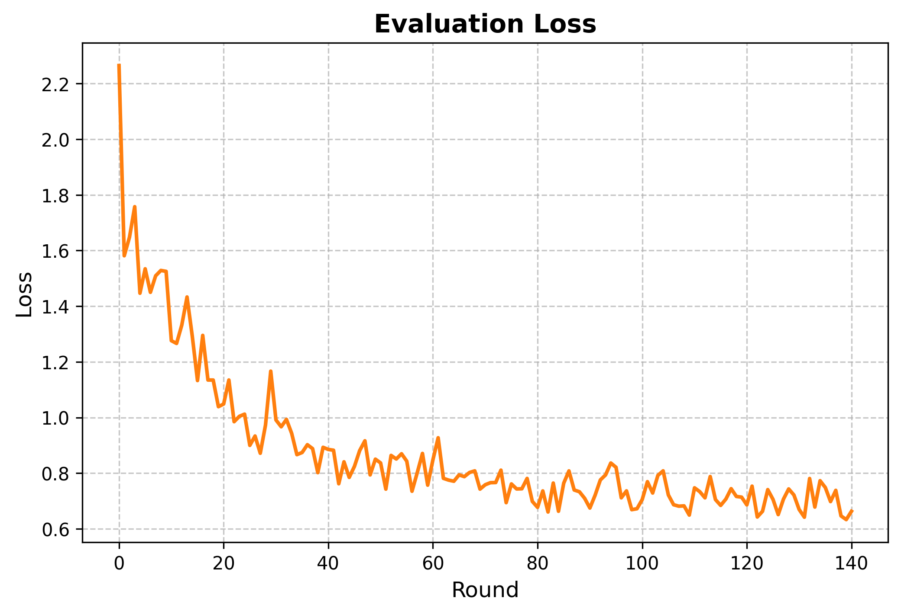

# CL-FCL Baseline

A compact, explicit PyTorch baseline for **Federated Learning (FL)** and **Federated Continual Learning (FCL)**, plus an implementation of **FedKEMF** (Knowledge Extraction and Multi-model Fusion style training).

The code intentionally avoids:
- registries
- YAML configs
- implicit component construction

Everything is created directly in Python so the flow is easy to read and edit.

**What's included**

Federated Learning (FL)
- `FedAvgAggregator`
- `FederatedServer`, `FederatedClient`, `FederatedExperiment`

Federated Continual Learning (FCL)
- `NaiveContinualStrategy`
- `ContinualClient`, `FCLServer`, `FCLExperiment`

FedKEMF (knowledge distillation + multi-model fusion)
- `FedKEMClient`
- `FedKEMServerAggregator`
- `run_FedKEMF.py`

Data + Models
- `RandomClassificationDataset`
- `MLPClassifier`, `SimpleCNN`
- `VGG11`, `ResNet18`, `ResNet20`, `ResNet32`


**Quickstart**

Run FL (FedAvg):
```bash
python -m cl_fcl_baseline.experiments.run_FedAvg
```

Run FCL:
```bash
python -m cl_fcl_baseline.experiments.run_fcl
```

Run FedKEMF:
```bash
python -m cl_fcl_baseline.experiments.run_FedKEMF
```

**FedKEMF usage notes**

FedKEMF uses a small knowledge network on the client side and an optional server-side distillation step. Important settings live in `cl_fcl_baseline/experiments/args.py` and are parsed by `run_FedKEMF.py`.

Common options:
- `--num-clients` total clients
- `--client-sample-ratio` fraction of clients per round
- `--partition` `iid` or `noniid`
- `--noniid-method` `dirichlet` or `shards`
- `--dirichlet-beta` heterogeneity (smaller = more non-IID)
- `--num-rounds` communication rounds
- `--local_epochs` local epochs per round
- `--batch-size` batch size
- `--lr` learning rate
- `--model` `mlp` | `simplecnn` | `VGG11` | `ResNet18` | `ResNet20` | `ResNet32`
- `--distill` enable client-side distillation
- `--mutual-learning` enable deep mutual learning
- `--server-distill-epochs` server distillation epochs
- `--server-distill-lr` server distillation learning rate
- `--server-distill-temperature` server distillation temperature
- `--server-ensemble` `max` or `mean`
- `--server-data-ratio` fraction of *training* data used as server public set

Example (reproducing experiments):

first one:
```bash
python -m cl_fcl_baseline.experiments.run_FedKEMF \
  --seed 0\
  --dataset cifar10 \
  --model VGG11 \
  --num-clients 30 \
  --client-sample-ratio 0.4 \
  --partition noniid \
  --noniid-method dirichlet \
  --dirichlet-beta 0.5 \
  --num-rounds 200 \
  --distill-epochs 10 \
  --batch-size 64 \
  --lr 0.01 \
  --server-data-ratio 0.6 \
  --optimizer sgd \
  --algorithm fedkemf \
  --distill-temperature 2.0 \
  --server-ensemble max \
  --server-distill-epochs 1 \
  --server-distill-temperature 2.0 \
  --server-distill-lr 0.01 \
```
result:




**Logs**

Training and evaluation logs are written to `cl_fcl_baseline/experiments/logs/` as JSONL files when `--log-file` is not provided. Each line is a JSON record with `type=train|eval`, `round`, and `metrics`.

**Philosophy**

This project is a baseline for quick experiments:
- explicit construction over configuration files
- minimal abstractions
- readable core logic over features

If you want to add new models or datasets, just import them and wire them up in Python.
